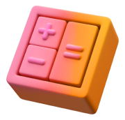
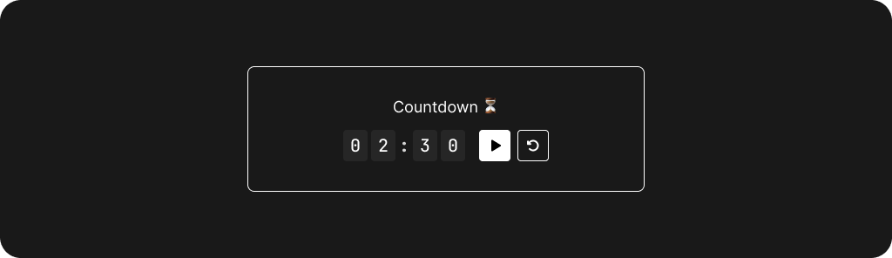
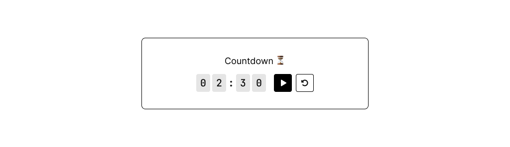

## Overview

- [Documentation](https://andredezzy.notion.site/Documentation-97678f1e84ed42a8a808b86f80c75a72)
  - [Countdown](https://andredezzy.notion.site/Countdown-ae7b20ce0249491caefb2be218a43692)
  - [Timer](https://andredezzy.notion.site/Timer-soon-fef173755f344adba9a4fee491915567)
  - [Counter](https://andredezzy.notion.site/Counter-soon-0621e09d68c242089e23ac2f1957a469)
- [Storybook](https://storybook.notion-widgets.andredezzy.com/)
- [Example](https://andredezzy.notion.site/Week-25-3cdb6007b92740a79d2e5c900711fa97)
- [Design](#Design)

  
  

## To-do

> **Warning**
> This app is a work in progress. I'm building this in public. 

- [X] Setup project with Storybook
- [X] Countdown widget
- [X] Theming based on system
- [X] Publish Storybook
- [ ] Timer widget
- [ ] Counter widget
- [ ] Add testing

## Design

You can find the project UI design here: [Figma](https://www.figma.com/file/PEL2Z5PaCwk0SYfZ2isLzh/Notion-Widgets?node-id=1%3A696)

## Roadmap

> **Warning**
> This app is a work in progress. I'm building this in public. 

If Hemes currently doesn't have a certain feature you think it's awesome, be sure to check out the [roadmap](https://andredezzy.notion.site/Notion-Widgets-7f6b16fa8034408398cca02c814179d9) to see if this is already planned for the future. Otherwise, we recommend you create a [discussion](https://github.com/andredezzy/notion-widgets/discussions/new?category=ideas) describing your enhancement request.

## Contributing

This repository is currently under development. If you want to contribute please fork the repository and get your hands dirty, and make the changes as you'd like and submit the Pull request.

## License

MIT License © [André "Dezzy" Victor](https://github.com/andredezzy)
